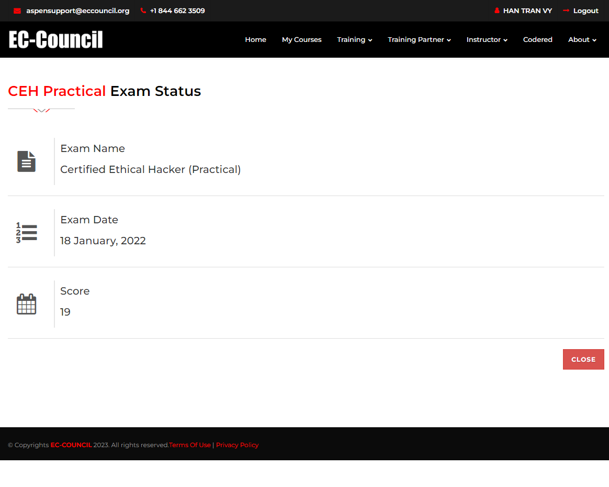

<h2>CEH PRACTICAL NOTES (v11)</h2> 
<b>Table of Contents</b> 
1. [Module 01 - Introduction to Ethical Hacking]  
2. [Module 02 - Footprinting and Reconnaissance]  
3. [Module 03 - Scanning Networks]  
4. [Module 04 - Enumeration]  
5. [Module 05 - Vulnerability Analysis]  
6. [Module 06 - System Hacking]  
7. [Module 07 - Malware Threats]  
8. [Module 08 - Sniffing]  
9. [Module 09 - Social Engineering]  
10. [Module 10 - Denial of Service]  
11. [Module 11 - Session Hijacking]  
12. [Module 12 - Evading IDS, Firewalls, and Honeypots]  
13. [Module 13 - Hacking Web Servers]  
14. [Module 14 - Hacking Web Applications]  
15. [Module 15 - SQL Injection]  
16. [Module 16 - Hacking Wireless Networks]  
17. [Module 17 - Hacking Mobile Platforms]  
18. [Module 18 - Hacking IoT and OT Hacking]  
19. [Module 19 - Cloud Computing]  
20. [Module 20 - Cryptography]  

